---
title: SPE Mini Project-DevOps Calculator.
author:
  - Himanshu Shankar Digrase, MT2022155
date: March 2023
toc: yes
---
<!-- ## Table of Contents
1. [Introduction](#introduction)
   -  [What and Why DevOps ?](#what-and-why-devops)
   -  [Tools Used](#tools-used)
2. [Programming Language - JAVA](#1-programming-language---java)
3. [Project Build / Project Management Tool - Maven](#2-project-build--project-management-tool---maven)
    - [Maven Commands](#maven-commands)
4. [Unit testing Tool- JUnit (ver. 4.13.2)](#3-unit-testing-tool--junit-ver-4132)
5. [Source Code management Tool - Git with GitHub](#4--source-code-management-tool---git-with-github)
   - [Git Commands](#git-commands-→)
6. [Logger / Log File Generator - log4j](#5-logger--log-file-generator---log4j)
7. [Containerization - Docker](#6-containerization---docker)
   - [Dockerfile](#dockerfile)
8. [Continuous Integration - Github Actions](#7-continuous-integration---github-actions)
    - [The components of GitHub Actions](#the-components-of-github-actions)
    - [Workflows](#workflows)
    - [Events](#events)
    - [Jobs](#jobs)
    - [Actions](#actions)
    - [Runners](#runners)
    - [Understanding the workflow file](#understanding-the-workflow-file)
    - [Errors occured during CI/CD in configuring Github Actions](#errorschallenges-occured-during-cicd-in-configuring-github-actions)
    - [Running Calculator Application on Container Image](#running-calculator-application-on-container-image)
9. [Monitoring Tool: ELK Stack](#8-monitoring-tool-elk-stack)
10.   [URLs and Script Files](#urls-and-script-file) -->
\pagebreak

## **Introduction**
I have developed a command-line scientific calculator application for the SPE mini project. It is a Java language based  scientific calculator application with 4 operations -

1. Square root - $\sqrt{x}$
2. Factorial - $x!$
3. Power - $x^a$
4. Logarithmic - $\log({x})$

The project is built using the maven build tool and, It is following DevOps practices.

#### **What and Why DevOps ?**

DevOps is a set of practices that combines Software Development (Dev) and IT Operations (Ops). It tries to implement continuous build - continuous integration and continuous deployment which indeed shorten the systems development life cycle and provide continuous delivery with quality software, used mainly for quick fixes.

#### **Tools Used -**

1. **Programming Language:** Java - 1.8 (JDK 8)
2. **Project Build / Project Management Tool:** maven (Apache)
3. **Unit testing Tool:** JUnit - version. 4.13.2
4. **SCM (Source Code Management):** Git with GitHub <https://github.com/himanshudigrase/calculatorDevOps>
5. **Logger / Log file generator:** log4j - version. 2.17.1
6. **Containerization:** Docker - DockerHub (public cloud repository for storing image) <https://hub.docker.com/repository/docker/hims0301/calculator_devops/tags>
7. **Continuous Integration:** Github Actions
8. **Continuous Deployment:** Github Actions
9. **Monitoring Tool:** ELK Stack (visualization using - Kibana)

\pagebreak


## **1. Programming Language - JAVA**

Implemented 4 functions for scientific calculator operations - added menu to choose which operation is to be performed, implemented switch case control structure to select / choose any one of the 4 operations in application.

Created maven project on IntelliJ IDE - it has created maven folder structure which contains src folder which will contain main function of application, test folder for JUnit test cases and pom.xml file which will handle the project dependencies.


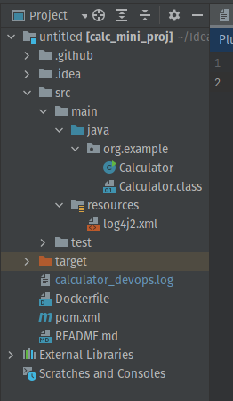{width=400px height=400px}
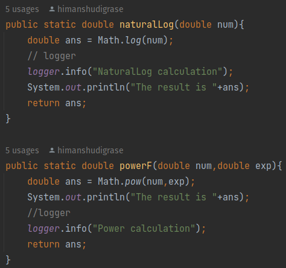{width=400px height=400px}
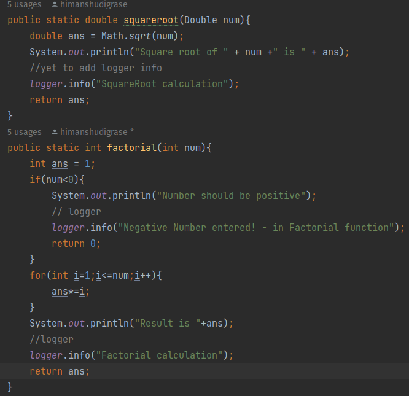{width=400px height=400px}


Executing Calculator application on locally on IntelliJ

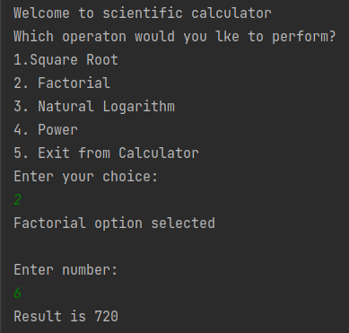{width=400px height=300px}
\pagebreak


## **2. Project Build / Project Management Tool - Maven**

Maven is a powerful project management tool that is based on POM (project object model). It is used for projects build, dependency and documentation. In short terms we can say that maven is a tool that can be used for building and managing any Java-based project also useful in configuring all the dependencies it downloads these dependencies specified in pom.xml once it is downloaded from server it is stored in local project cache, and used for next builds.

Here, I have used maven which will be creating an executable .jar file which will package all dependencies specified in POM file; here dependencies such as JUnit and log4j will be bundled up with this executable binary jar in the target folder. pom.xml file manages the metadata, dependencies and plugins for the project.

### **Maven commands**

**mvn clean -** Clean the project hierarchy and clear the cache in the Maven hierarchy, if target folder already present it will delete and create newly for fresh build

**mvn compile -** The main goal here is to compile all the source code files in the ’src/main/java/Application.Calculator’ folder.

**mvn install -** Installs the package into the local repository, for use as a dependency in other projects
locally.

**mvn package -** take the compiled code and package it in its distributable format, such as a JAR.

Run the command, mvn clean install

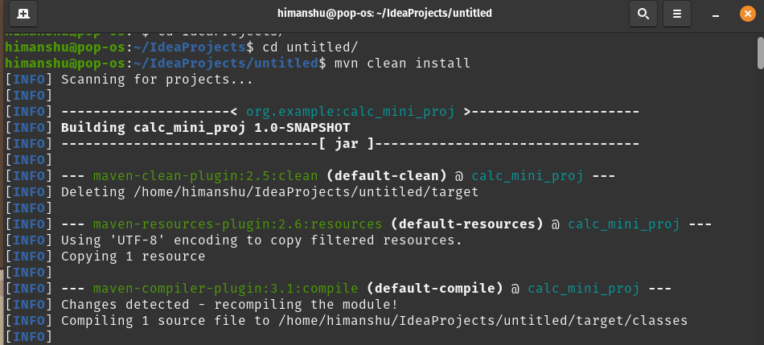

\pagebreak


## **3. Unit testing Tool- JUnit (ver. 4.13.2)**

JUnit is a unit testing framework for the Java programming language. JUnit has been important in the development of test-driven development. Following are snippets from the Calculator Project that implements two types of unit test cases for each of the calculator operations - method.

True positive assertEquals, where we expect the output of the method to what we have stated.

True negative, assertNotEquals, where we expect the method to not be equal to what we have stated / expected.

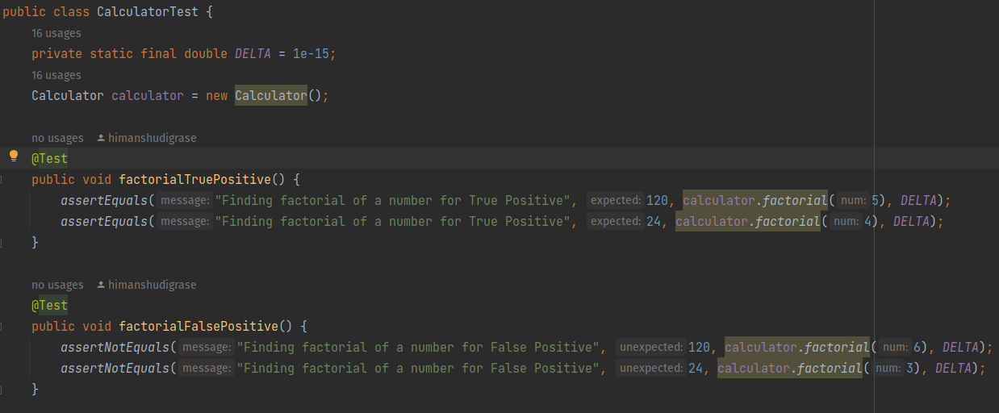
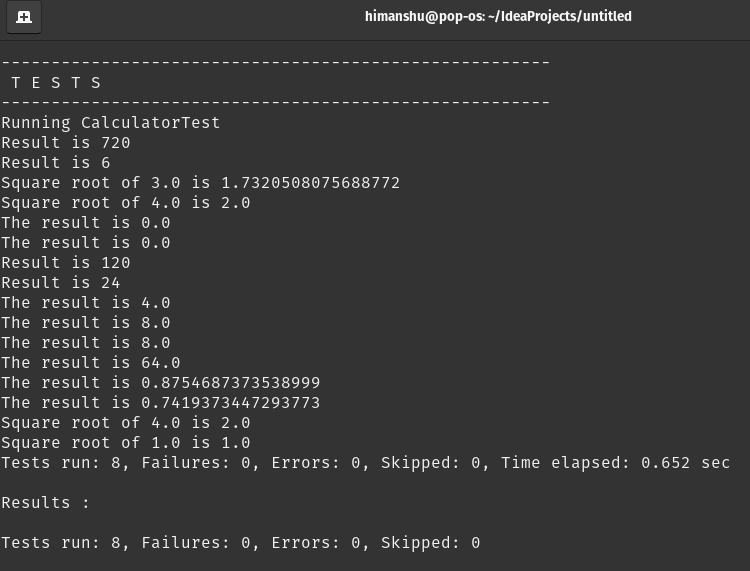

\pagebreak

## **4 . Source Code management Tool - Git with GitHub**

Source code management (SCM) is used to track modifications to a source code repository. SCM is also synonymous with Version Control System (VCS). SCM tracks the running history of changes as well as backup previous checkpoints in project codebase and helps resolve conflicts when merging updates, or any merge conflicts that happen when multiple developers working on the same module of project.

I have created a repository on GitHub<https://github.com/himanshudigrase/calculatorDevOps>
and then configured the Maven project of my local repository to update the local folder structure to remote GitHub repo using Git commands.

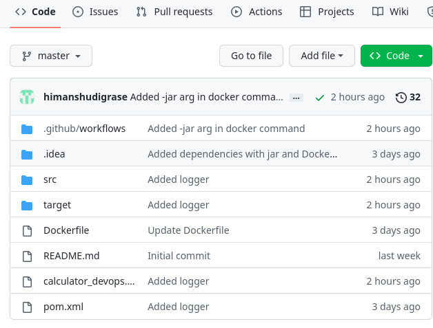

### **Git Commands →**


**git init -** it will initialize my java maven project as a Git repository.

**git remote add origin <GitHub\_URL>.git** - Link the local Git repository to the remote GitHub repository whose URL is specified in the command and the link is given the name origin


**git add .  -** Adds all the unstaged files and untracked changes in the current directory to the staging area for committing.

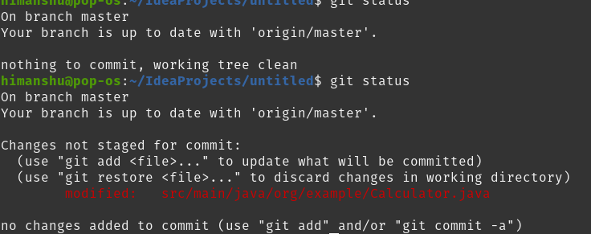

**git commit -m “<commit\_message>” -** Commit the added changes to the local Git repository also creates checkpoint for version history based on commit message one can get idea about changes happened on that steam / branch

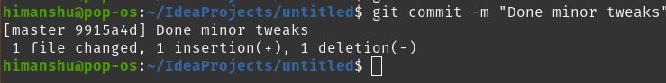

**git push -u origin master -** Push the latest commits from the local Git repository master branch to the remote GitHub master branch

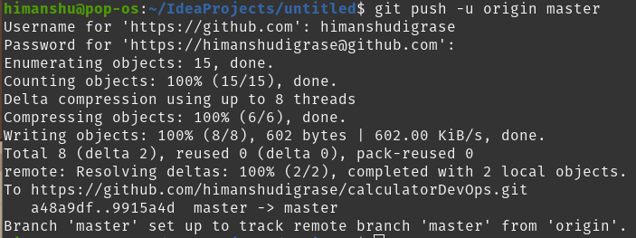

\pagebreak


## **5. Logger / Log File Generator - log4j**

Logging keeps track of all the operations that were performed in the application, warnings, debugging information, errors etc. Apache log4j is a Java-based logging utility originally written by Ceki Gülcü. log4j is java logging framework - these dependency is added to maven pom.xml file so that final executable jar file gets bundled with these dependency of log4j

Its configuration is provided via the log4j2.xml file which is stored under the resources directory of the project and for this project, it is configured as follows,


Now we need to add logger functions in the main application code which uses the logger which is initialized as below. And then the logger can be called to generate log messages as follows,

>*private static final Logger logger = LogManager.getLogger(Calculator.class);*
>
>*logger.info("SquareRoot calculation");*
>
>*logger.info("Factorial calculation");*
>
>*logger.info("NaturalLog calculation");*
>
>*logger.info("Power calculation");*
>
>*logger.info("Invalid Input! Closing Application");*
\pagebreak


## **6. Containerization - Docker**

Docker is an open platform for developing, shipping, and running applications. Docker helps you to seperate your applications from your infrastructure so you can deliver software quickly.

Docker containerization - it is OS level virtualization it is a modern day technique used instead of VM machines for deployment of software.

Using Docker’s methodologies for shipping, testing, and deploying code quickly, you can significantly reduce the delay between writing code and running it in production.

Created docker hub repo - <https://hub.docker.com/repository/docker/hims0301/calculator_devops/tags>

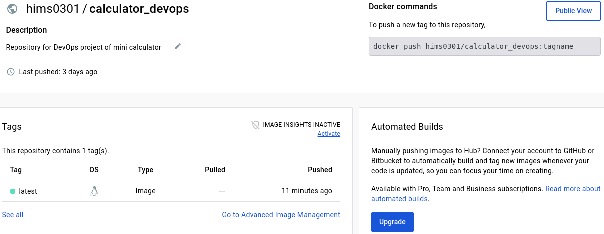

Docker builds images automatically by reading the instructions from a Dockerfile - a text file

that contains all commands, in order, needed to build a given image.

In this project, we need to create a container that executes the built Maven project. JAR file that is being created using the following command.

>*java -cp <path\_to\_jar\_file> <class\_package\_name>*

### **Dockerfile**

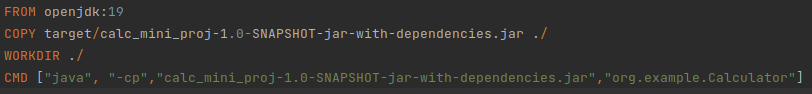

Once image is created by following steps in Dockerfile, next step is to push this image into DockerHub which is going to be automated by Github Actions script *(covered in next section)*
\pagebreak


## **7. Continuous Integration - Github Actions**

**Github Actions** - GitHub Actions is a continuous integration and continuous delivery (CI/CD) platform that allows you to automate your build, test, and deployment pipeline. You can create workflows that build and test every pull request to your repository, or deploy merged pull requests to production.

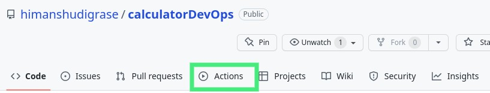

### The components of GitHub Actions
You can configure a GitHub Actions workflow to be triggered when an event occurs in your repository, such as a pull request being opened or an issue being created. Your workflow contains one or more jobs which can run in sequential order or in parallel. Each job will run inside its own virtual machine runner, or inside a container, and has one or more steps that either run a script that you define or run an action, which is a reusable extension that can simplify your workflow.

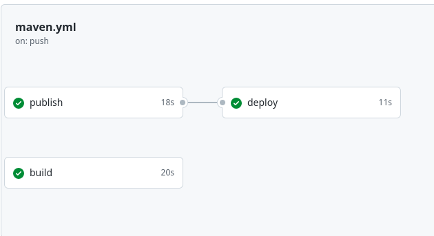

### **Workflows**
A workflow is a configurable automated process that will run one or more jobs. Workflows are defined by a YAML file checked in to your repository and will run when triggered by an event in your repository, or they can be triggered manually, or at a defined schedule.

Workflows are defined in the *.github/workflows* directory in a repository, and a repository can have multiple workflows, each of which can perform a different set of tasks. For example, you can have one workflow to build and test pull requests, another workflow to deploy your application every time a release is created, and still another workflow that adds a label every time someone opens a new issue.

### **Events**
An event is a specific activity in a repository that triggers a workflow run. For example, activity can originate from GitHub when someone creates a pull request, opens an issue, or pushes a commit to a repository. You can also trigger a workflow to run on a schedule, by posting to a REST API, or manually.

### **Jobs**
A job is a set of steps in a workflow that is executed on the same runner. Each step is either a shell script that will be executed, or an action that will be run. Steps are executed in order and are dependent on each other. Since each step is executed on the same runner, you can share data from one step to another. For example, you can have a step that builds your application followed by a step that tests the application that was built.

You can configure a job's dependencies with other jobs; by default, jobs have no dependencies and run in parallel with each other. When a job takes a dependency on another job, it will wait for the dependent job to complete before it can run. For example, you may have multiple build jobs for different architectures that have no dependencies, and a packaging job that is dependent on those jobs. The build jobs will run in parallel, and when they have all completed successfully, the packaging job will run.


### **Actions**
An action is a custom application for the GitHub Actions platform that performs a complex but frequently repeated task. Use an action to help reduce the amount of repetitive code that you write in your workflow files. An action can pull your git repository from GitHub, set up the correct toolchain for your build environment, or set up the authentication to your cloud provider.

You can write your own actions, or you can find actions to use in your workflows in the GitHub Marketplace.

### **Runners**
A runner is a server that runs your workflows when they're triggered. Each runner can run a single job at a time. GitHub provides Ubuntu Linux, Microsoft Windows, and macOS runners to run your workflows; each workflow run executes in a fresh, newly-provisioned virtual machine. GitHub also offers larger runners, which are available in larger configurations. If you need a different operating system or require a specific hardware configuration, you can host your own runners.


> 

name: Java CI with Maven

    on:
     push:
        branches: [ "master" ]
     pull_request:
        branches: [ "master" ]

    jobs:
      build:
          runs-on: ubuntu-latest
          steps:
          - uses: actions/checkout@v3
          - name: Set up JDK 19
            uses: actions/setup-java@v3
            with:
              java-version: '19'
              distribution: 'temurin'
              cache: maven
          - name: Build with Maven
            run: mvn -B package --file pom.xml
      publish:
        runs-on: ubuntu-latest
        steps:
        - name: Checkout code
          uses: actions/checkout@v2
        - name: Build Docker image
          run: docker build -t hims0301/calculator_devops:latest .
        - name: Log in to Docker registry
          uses: docker/login-action@v1
          with:
            registry: docker.io
          username: ${{ secrets.DOCKER_USERNAME }}
          password: ${{ secrets.DOCKER_PASSWORD }}
        - name: Push Docker image
          run: docker push hims0301/calculator_devops:latest
      deploy:
        needs: publish
        runs-on: self-hosted
        steps:
          - name: Pull Docker image
            run: docker pull hims0301/calculator_devops:latest
          - name: Stop running calculator-container
            run: docker stop calculator-container || true
          - name: remove container named calculator-container
            run: docker rm calculator-container || true
          - name: Start new container
            run: docker run --name calculator-container -d -t hims0301/calculator_devops:latest 
            java -jar calc_mini_proj-1.0-SNAPSHOT-jar-with-dependencies.jar
\pagebreak


### **Understanding the workflow file**
To help you understand how YAML syntax is used to create a workflow file, this section explains each line of the above workflow:

    name: Java CI with Maven 
>
>Optional - The name of the workflow as it will appear in the "Actions" tab of the GitHub repository.


    on:
      push:
        branches: [ "master" ]
      pull_request:
        branches: [ "master" ]
>
>Specifies the trigger for this workflow. This example uses the *push* and *pull* event, so a workflow run is triggered every time someone pushes a change to the repository or merges a pull request. This is triggered by a push to every branch; 

    jobs:
>Groups together all the jobs that run in the *Java CI with Maven* workflow.

    runs-on: ubuntu-latest

>Configures the job to run on the latest version of an Ubuntu Linux runner. This means that the job will execute on a fresh virtual machine hosted by GitHub. 

    steps:

>Groups together all the steps that run in the *Java CI with Maven* job. Each item nested under this section is a separate action or shell script.

    uses: actions/checkout@v3
>
>The uses keyword specifies that this step will run v3 of the actions/checkout action. This is an action that checks out your repository onto the runner, allowing you to run scripts or other actions against your code (such as build and test tools). You should use the checkout action any time your workflow will run against the repository's code.

       uses: actions/setup-java@v3
       with:
        java-version: '19'
        distribution: 'temurin'
        cache: maven
      - name: Build with Maven
        run: mvn -B package --file pom.xml
>
>Above snippet set ups our server with JAVA JDK 19 and build our pom.xml with the help of maven

    - name: Build Docker image
      run: docker build -t hims0301/calculator_devops:latest .
>This snippet builds docker image for out repository under user *hims0301* with repository name : *calculator_devops*

    - name: Log in to Docker registry
      uses: docker/login-action@v1
      with:
          registry: docker.io
          username: ${{ secrets.DOCKER_USERNAME }}
          password: ${{ secrets.DOCKER_PASSWORD }}
> Above snippet allows us to login into our dockerhub repository with provided username and password stores inside secret folder of github repository

    - name: Push Docker image
      run: docker push hims0301/calculator_devops:latest

> This pushes our docker image to our docker hub 

    deploy:
    needs: publish
    runs-on: self-hosted

> Job named *deploy* deploys our job to our localhost and needs job named *publish* to be finished first.


    steps:
      - name: Pull Docker image
        run: docker pull hims0301/calculator_devops:latest
      - name: Stop running calculator-container
        run: docker stop calculator-container || true
      - name: remove container named calculator-container
        run: docker rm calculator-container || true
      - name: Start new container
        run: docker run --name calculator-container -d -t hims0301/calculator_devops:latest 
        java -jar calc_mini_proj-1.0-SNAPSHOT-jar-with-dependencies.jar


> Above steps pulls docker image to our localhost and makes a new container (if it doesn't exist) and runs the .jar file        

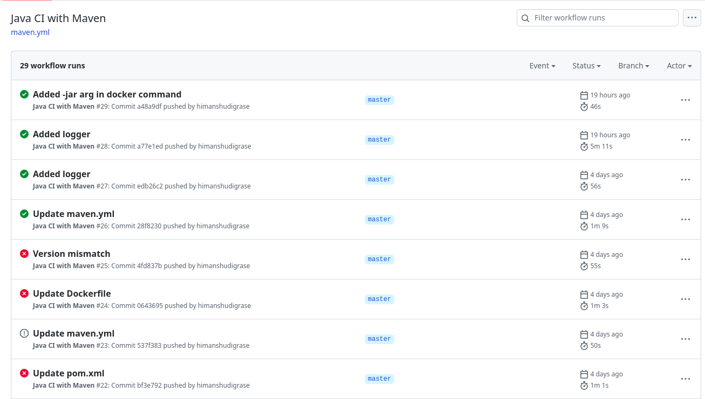
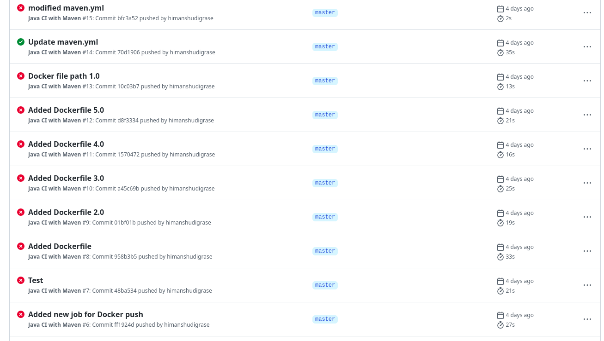
\pagebreak

### **Errors/Challenges occured during CI/CD in configuring Github Actions**

1. Unable to locate Dockerfile.

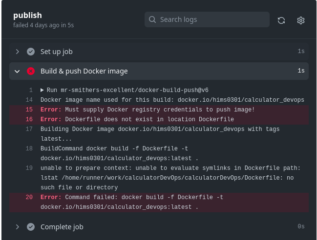   

>Solution: Relocated Dockerfile to project directory from .github/workflows folder

\pagebreak

2. Got error of input device not a tty due to -t flag specified in *docker run* command

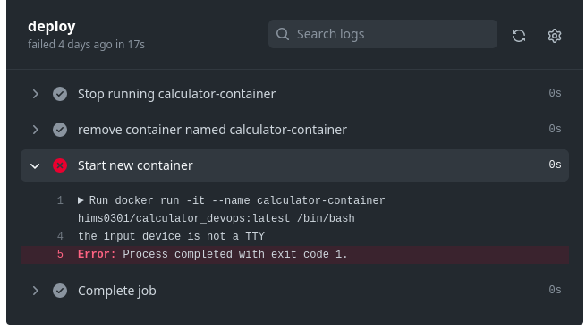

>Solution: Removed -t flag from docker run command

3. Got version mismatch error due to different version of JDK specified in pom.xml and Dockerfile

>Solution: Configured both platforms with JDK 19


\pagebreak


### Running Calculator Application on Container Image

To check latest images of calculator\_devops -

- ***docker images***
- ***docker ps -a***

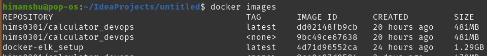

To run application image on container

- ***docker run -it hims0301/calculator_devops***

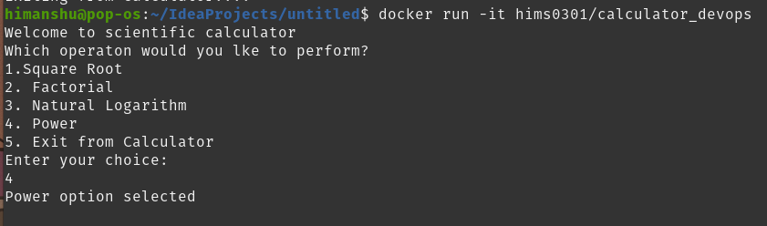

\pagebreak


## **8. Monitoring Tool: ELK Stack**

"**ELK**" is the acronym for three open source projects:Elasticsearch, Logstash, and Kibana.

ELK stack gives us the ability to aggregate logs from all the systems and applications, analyze these logs, and create visualizations for application and infrastructure monitoring, faster troubleshooting, security analytics, and more.

Kibana Visualization of log-file using - **GROK** pattern to decode logging messages


<!--  -->

**GROK pattern  →**
  ```
    %{HTTPDATE:timestamp_string} \[%{GREEDYDATA:thread}\] \[%{LOGLEVEL:level}\] %{GREEDYDATA:logger} \- %{GREEDYDATA:message}
  ```

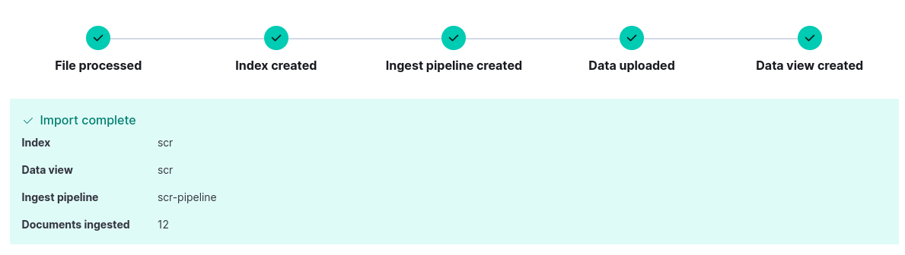

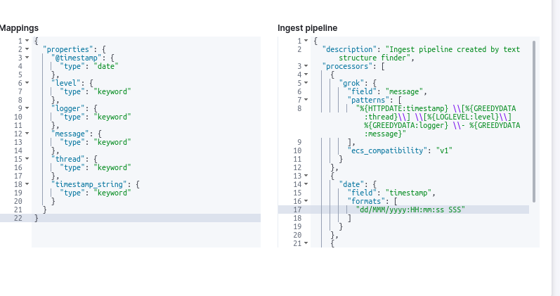

\pagebreak


### **Kibana Visualization**

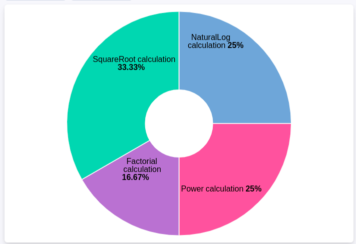
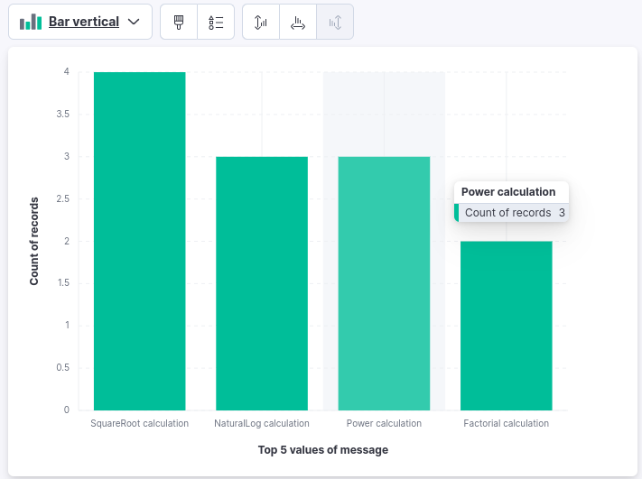


\pagebreak


### **URLs and Script File**

**GitHub Repository** - [https://github.com/himanshudigrase/calculatorDevOps ](https://github.com/himanshudigrase/calculatorDevOps)

**DockerHub -**

Docker Image - [https://hub.docker.com/repository/docker/hims0301/calculator_devops/tags](https://hub.docker.com/repository/docker/hims0301/calculator_devops/tags)

Repository - <https://hub.docker.com/repository/docker/hims0301/calculator_devops>

**Pipeline script -**

    name: Java CI with Maven

    on:
        push:
            branches: [ "master" ]
        pull_request:
            branches: [ "master" ]

    jobs:
      build:
          runs-on: ubuntu-latest
          steps:
          - uses: actions/checkout@v3
          - name: Set up JDK 19
            uses: actions/setup-java@v3
            with:
              java-version: '19'
              distribution: 'temurin'
              cache: maven
          - name: Build with Maven
              run: mvn -B package --file pom.xml
      publish:
          runs-on: ubuntu-latest
          steps:
          - name: Checkout code
            uses: actions/checkout@v2
          - name: Build Docker image
              run: docker build -t hims0301/calculator_devops:latest .
          - name: Log in to Docker registry
              uses: docker/login-action@v1
              with:
                  registry: docker.io
                  username: ${{ secrets.DOCKER_USERNAME }}
                  password: ${{ secrets.DOCKER_PASSWORD }}
          - name: Push Docker image
              run: docker push hims0301/calculator_devops:latest
      deploy:
        needs: publish
        runs-on: self-hosted
        steps:
          - name: Pull Docker image
            run: docker pull hims0301/calculator_devops:latest
          - name: Stop running calculator-container
            run: docker stop calculator-container || true
          - name: remove container named calculator-container
            run: docker rm calculator-container || true
          - name: Start new container
            run: docker run --name calculator-container -d -t hims0301/calculator_devops:latest      
            java -jar calc_mini_proj-1.0-SNAPSHOT-jar-with-dependencies.jar

**Dockerfile -**
  
    FROM openjdk:19
    COPY target/calc_mini_proj-1.0-SNAPSHOT-jar-with-dependencies.jar ./
    WORKDIR ./
    CMD ["java", "-cp","calc_mini_proj-1.0-SNAPSHOT-jar-with-dependencies.jar",
    "org.example.Calculator"]
  

**GROK pattern -**
  ```
    %{HTTPDATE:timestamp\_string} \[%{GREEDYDATA:thread}\] \[%{LOGLEVEL:level}\] %{GREEDYDATA:logger} \- %{GREEDYDATA:message}
  ```

## **Thank You !**
